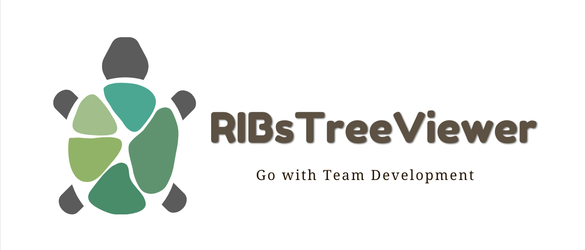
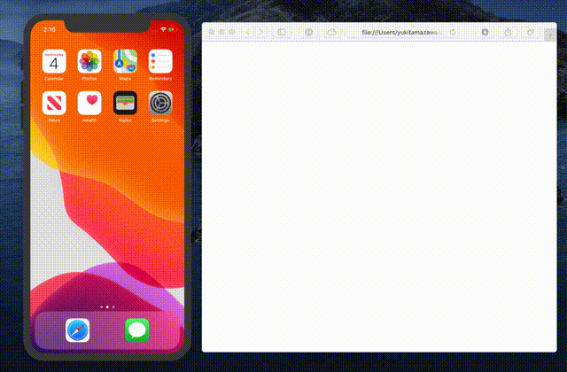
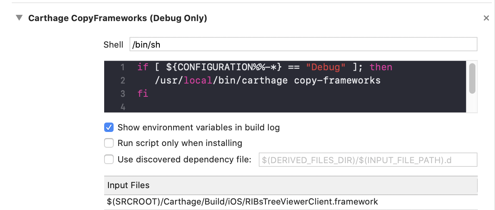
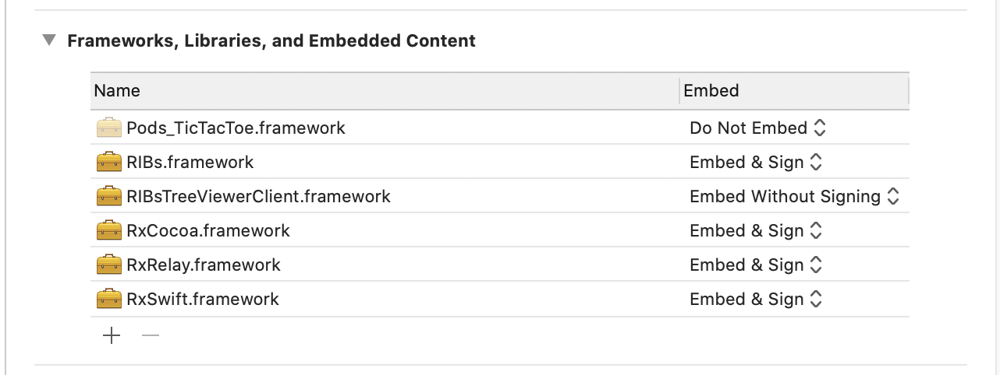

 
[](https://github.com/Carthage/Carthage)
# RIBsTreeViewer

  

Real Time viewing attached RIBs Tree on Browser

## Demo

  

## Using the Libraries

### XCFramework

Add the xcframework to your project。

```
./Products/RIBsTreeViewerClient.xcframework
```

### CocoaPods

This is not supported because the RIBs do not provide an up-to-date PodSpec, making it difficult to resolve dependencies.

### Carthage

```shell
github "srea/RIBsTreeViewerClient"
```

```
$ carthage update --platform iOS --no-use-binaries
```

#### Build Phase

  


Carthage CopyFrameworks (ONLY DEBUG)

```shell
 if [ ${CONFIGURATION%%-*} == "Debug" ]; then
    /usr/local/bin/carthage copy-frameworks
 fi
```

## Basic setup

```swift
@UIApplicationMain
public class AppDelegate: UIResponder, UIApplicationDelegate {

    private var ribsTreeViewer: RIBsTreeViewer? = nil
    
    public func application(_ application: UIApplication, didFinishLaunchingWithOptions launchOptions: [UIApplicationLaunchOptionsKey: Any]?) -> Bool {
        let window = UIWindow(frame: UIScreen.main.bounds)
        self.window = window

        let result = RootBuilder(dependency: AppComponent()).build()
        let launchRouter = result.launchRouter
        self.launchRouter = launchRouter
        urlHandler = result.urlHandler
        launchRouter.launch(from: window)
        startRIBsTreeViewer(launchRouter: launchRouter)
        return true
    }
}
```

```swift
// MARK: - RIBsTreeViewer

#if DEBUG
import RIBsTreeViewerClient

extension AppDelegate {
    private func startRIBsTreeViewer(launchRouter: Routing) {
        if #available(iOS 13.0, *) {
            ribsTreeViewer = RIBsTreeViewerImpl.init(router: launchRouter,
                                                     options: [.webSocketURL("ws://0.0.0.0:8080"),
                                                               .monitoringIntervalMillis(1000)])
            ribsTreeViewer?.start()
        } else {
            // RIBsTreeViewer is not supported OS version.
        }
    }
}
#endif
```

### Installing 

```
$ npm install yarn
```

### Starting the websocke server

```shell
$ npx yarn install
$ node index.js
```

## Open the page.

```shell
$ npx yarn install
$ npx webpack
$ open ./public/index.html
```