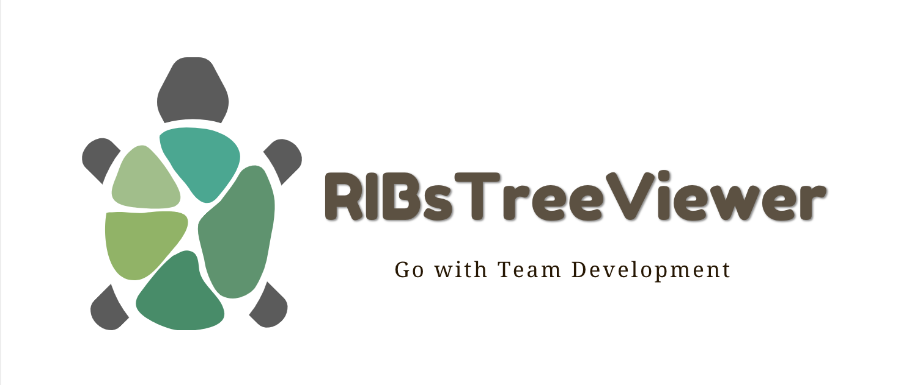
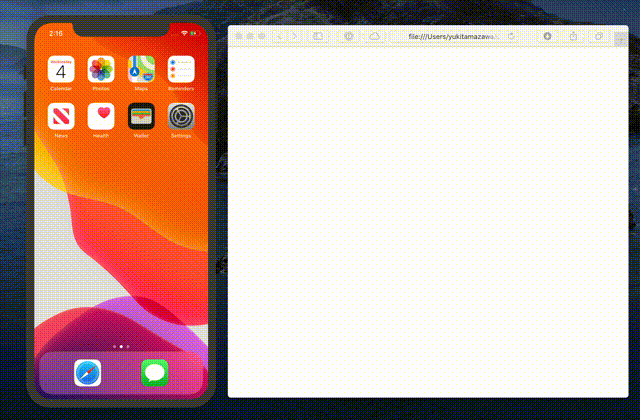

# RIBsTreeViewer



Real Time viewing attached RIBs Tree on Browser

## Demo



## Requirements

- **iOS 15+** (aligned with [RIBs-iOS](https://github.com/uber/RIBs-iOS) 1.0)
- Xcode 15+
- Node.js 20+ (WebSocket relay and browser viewer)

## Quick start (local tooling)

From a clean clone — **no Carthage**:

```shell
./scripts/verify.sh
```

Then run the viewer stack in three terminals:

```shell
# 1. WebSocket relay (port 8080)
cd WebSocketServer && npm install && npm start

# 2. Browser tree UI
cd Browser && yarn install && yarn build && open ./public/index.html

# 3. Your iOS app (DEBUG): attach RIBsTreeViewer to the launch router — see below
```

## Using the library in your app

### Swift Package Manager (recommended)

In Xcode: **File → Add Package Dependencies** → `https://github.com/srea/RIBsTreeViewerClient.git`

Or in `Package.swift`:

```swift
dependencies: [
    .package(url: "https://github.com/srea/RIBsTreeViewerClient.git", branch: "master"),
],
targets: [
    .target(
        name: "YourApp",
        dependencies: [
            .product(name: "RIBsTreeViewerClient", package: "RIBsTreeViewerClient"),
        ]
    ),
]
```

This pulls [RIBs-iOS](https://github.com/uber/RIBs-iOS) 1.0+ and RxSwift 6.x automatically.

### XCFramework

Add the prebuilt binary (no Carthage required for consumers):

```
./Products/RIBsTreeViewerClient.xcframework
```

Regenerate after changing library sources:

```shell
make generate_xcframeworks
```

### Carthage (legacy)

Carthage is **deprecated** for this repo ([#38](https://github.com/srea/RIBsTreeViewerClient/issues/38)). Prefer SPM or the XCFramework above.

## Basic setup (iOS app, DEBUG)

```swift
#if DEBUG
import RIBsTreeViewerClient

extension AppDelegate {
    private func startRIBsTreeViewer(launchRouter: Routing) {
        if #available(iOS 15.0, *) {
            let viewer = RIBsTreeViewerImpl(
                router: launchRouter,
                options: [
                    .webSocketURL("ws://127.0.0.1:8080"),
                    .monitoringIntervalMillis(1000),
                ]
            )
            viewer.start()
        }
    }
}
#endif
```

Use `127.0.0.1` when running the simulator on the same Mac as the WebSocket relay.

## Development commands

| Command | Description |
|---------|-------------|
| `./scripts/verify.sh` | Full usability check (SPM, Xcode, Browser, WebSocket) |
| `./scripts/build-spm-package.sh` | Build library via SwiftPM only |
| `make generate_xcframeworks` | Rebuild `Products/*.xcframework` |
| `make browser-build` | Build browser bundle |
| `make websocket-server` | Start WebSocket relay |

## Migration notes

- RIBs iOS now lives at [uber/RIBs-iOS](https://github.com/uber/RIBs-iOS) (not `uber/RIBs`).
- Minimum iOS is **15** for SPM / current sources; older XCFrameworks may still show iOS 13 in metadata until regenerated.
